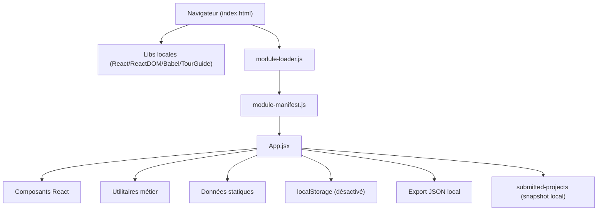

# Documentation technique — Distrib Navigator

## Description de la solution
Distrib Navigator est une application React autonome (sans serveur) qui guide les équipes projets et compliance via un questionnaire dynamique, calcule un niveau de risque, et génère une synthèse exploitable. L’outil fonctionne localement, sans API externe, avec des données statiques embarquées et un mécanisme d’export JSON pour l’archivage.

## Architecture générale


## Architecture détaillée
- **Chargement** : `index.html` charge les bibliothèques locales et le chargeur (`src/module-loader.js`) qui reconstruit les modules à partir de `src/module-manifest.js`.
- **Cœur applicatif** : `src/App.jsx` orchestre le questionnaire, la synthèse, les modes (chef de projet / admin), l’annotation et l’import/export.
- **Composants UI** : dossier `src/components/` (écrans, éditeurs, listes virtualisées).
- **Logique métier** : dossier `src/utils/` (règles, scoring, normalisation, export, persistance locale).
- **Référentiels** : dossier `src/data/` (questions, règles, équipes, pondérations).
- **Stockage** : localStorage prévu mais désactivé, et dépôt local dans `submitted-projects/`.

## Exigences fonctionnelles
- Questionnaire adaptatif (affichage conditionnel des questions).
- Calcul du score et niveau de complexité.
- Synthèse projet (risques, équipes concernées, recommandations).
- Mode administrateur/back-office pour gérer référentiels.
- Export JSON local des projets.
- Import de projets (snapshot local).
- Mode vitrine (showcase) et annotations.
- Aucune dépendance externe réseau (sécurité).

## Structure des bases de données (locale)
> Aucune base externe. Les données sont locales et statiques.

### localStorage (désactivé)
- **Clé** : `complianceNavigatorState`
- **Schéma** (quand activé) :
  - `projects[]` : liste de projets (id, projectName, answers, analysis, status, dates)
  - `questions[]` : référentiel de questions
  - `rules[]` : règles de scoring
  - `riskLevelRules[]` : règles de niveaux de risques
  - `riskWeights` : pondérations des risques
  - `teams[]` : équipes associées
  - `showcaseThemes[]` : thèmes vitrine
  - `projectFilters` : configuration des filtres

### submitted-projects/
- **directory-snapshot.js** : snapshot embarqué pour l’import.
- **projet*.json** : exemples d’exports projet.

## Structure des fichiers (vue d’ensemble)
```
.
├── index.html
├── mentions-legales.html
├── README.md
├── BUG_RISKS.md
├── docs/
│   ├── ARCHITECTURE.md
│   ├── OPTIMISATIONS.md
│   └── README.md
├── scripts/
│   ├── generate-module-manifest.js
│   └── generate-tailwind-lite.js
├── submitted-projects/
│   ├── README.md
│   ├── directory-snapshot.js
│   ├── projet1.json
│   ├── projet2.json
│   └── projet3.json
└── src/
    ├── App.jsx
    ├── main.jsx
    ├── react.js
    ├── module-loader.js
    ├── module-manifest.js
    ├── components/
    ├── data/
    ├── utils/
    ├── styles/
    └── vendor/
```

---

# Documentation par fichier

> Pour chaque fichier : **Résumé**, **Fonctionnalités**, **Paramètres**, **Cas d’usage**, **Dépendances**, **Notes techniques**.

## Racine

### `index.html`
- **Résumé** : Point d’entrée HTML qui charge les styles, les bibliothèques locales et l’application.
- **Fonctionnalités** : Préchargement des CSS, montage de l’app React, fallback d’erreur.
- **Paramètres** : Entrée `#root`; scripts locaux (`src/vendor/*`, `src/module-loader.js`).
- **Cas d’usage** : Ouvrir `index.html` pour lancer l’application sans serveur.
- **Dépendances** : `src/vendor/*.js`, `src/module-manifest.js`, `src/module-loader.js`.
- **Notes techniques** : Aucun CDN; exécution locale uniquement.

### `mentions-legales.html`
- **Résumé** : Page statique de mentions légales.
- **Fonctionnalités** : Affiche l’information légale.
- **Paramètres** : N/A.
- **Cas d’usage** : Lien depuis le footer.
- **Dépendances** : N/A.
- **Notes techniques** : Page autonome.

### `README.md`
- **Résumé** : Documentation d’introduction et des fonctionnalités.
- **Fonctionnalités** : Présentation produit et démarrage rapide.
- **Paramètres** : N/A.
- **Cas d’usage** : Onboarding des utilisateurs/lecteurs.
- **Dépendances** : N/A.
- **Notes techniques** : À maintenir avec les évolutions fonctionnelles.

### `BUG_RISKS.md`
- **Résumé** : Liste de risques/bugs connus.
- **Fonctionnalités** : Suivi des limites actuelles.
- **Paramètres** : N/A.
- **Cas d’usage** : Audit qualité.
- **Dépendances** : N/A.
- **Notes techniques** : Sert à prioriser les améliorations.

## `docs/`

### `docs/ARCHITECTURE.md`
- **Résumé** : Documentation d’architecture existante.
- **Fonctionnalités** : Contexte sur la solution.
- **Paramètres** : N/A.
- **Cas d’usage** : Référence technique.
- **Dépendances** : N/A.
- **Notes techniques** : Complété par ce README.

### `docs/OPTIMISATIONS.md`
- **Résumé** : Pistes d’optimisation.
- **Fonctionnalités** : Recensement d’améliorations.
- **Paramètres** : N/A.
- **Cas d’usage** : Roadmap technique.
- **Dépendances** : N/A.
- **Notes techniques** : À mettre à jour selon le backlog.

### `docs/README.md`
- **Résumé** : Documentation détaillée (ce fichier).
- **Fonctionnalités** : Architecture, exigences, fichiers.
- **Paramètres** : N/A.
- **Cas d’usage** : Référence technique centralisée.
- **Dépendances** : N/A.
- **Notes techniques** : Maintenir la version et les liens.

## `scripts/`

### `scripts/generate-module-manifest.js`
- **Résumé** : Génère `src/module-manifest.js` à partir des fichiers JS/JSX.
- **Fonctionnalités** : Scan des modules, exclusion des vendors, sérialisation JSON.
- **Paramètres** : Répertoire `src/`, extensions `.js/.jsx`.
- **Cas d’usage** : Après modification des modules JS/JSX.
- **Dépendances** : Node.js, `fs`, `path`.
- **Notes techniques** : Ne pas éditer manuellement le manifest.

### `scripts/generate-tailwind-lite.js`
- **Résumé** : Génère une version allégée de Tailwind.
- **Fonctionnalités** : Build CSS local optimisé.
- **Paramètres** : Entrées/Sorties définies dans le script.
- **Cas d’usage** : Mise à jour des styles.
- **Dépendances** : Node.js.
- **Notes techniques** : Garder en synchro avec `src/styles/`.

## `submitted-projects/`

### `submitted-projects/README.md`
- **Résumé** : Instructions sur les projets soumis.
- **Fonctionnalités** : Contexte d’archivage.
- **Paramètres** : N/A.
- **Cas d’usage** : Consultation d’exports.
- **Dépendances** : N/A.
- **Notes techniques** : Stockage local uniquement.

### `submitted-projects/directory-snapshot.js`
- **Résumé** : Snapshot local des projets importables.
- **Fonctionnalités** : Source de données pour l’import en mode offline.
- **Paramètres** : Structure JSON sérialisée.
- **Cas d’usage** : Chargement des projets soumis.
- **Dépendances** : `src/utils/externalProjectsLoader.js`.
- **Notes techniques** : Généré/maintenu côté dépôt.

### `submitted-projects/projet1.json` / `projet2.json` / `projet3.json`
- **Résumé** : Exemples d’exports de projet.
- **Fonctionnalités** : Données de démonstration.
- **Paramètres** : JSON projet.
- **Cas d’usage** : Tests manuels/import.
- **Dépendances** : Utilisés par l’import local.
- **Notes techniques** : Ne contient aucune donnée sensible.

---

## `src/`

### `src/main.jsx`
- **Résumé** : Bootstrapping React et rendu racine.
- **Fonctionnalités** : Choix `createRoot` ou `render` selon compatibilité.
- **Paramètres** : Entrée DOM `#root`.
- **Cas d’usage** : Démarrage de l’app.
- **Dépendances** : `src/react.js`, `src/App.jsx`.
- **Notes techniques** : Fallback si ReactDOM indisponible.

### `src/react.js`
- **Résumé** : Bridge vers les globals React/ReactDOM.
- **Fonctionnalités** : Expose hooks et API React.
- **Paramètres** : Globals `window.React`, `window.ReactDOM`.
- **Cas d’usage** : Importer React sans bundler.
- **Dépendances** : `src/vendor/react*.min.js`.
- **Notes techniques** : Lève une erreur si React n’est pas chargé.

### `src/module-loader.js`
- **Résumé** : Chargeur de modules basé sur le manifest JSON.
- **Fonctionnalités** : Résolution d’imports, sandboxing minimal.
- **Paramètres** : `window.__COMPLIANCE_NAVIGATOR_MANIFEST__`.
- **Cas d’usage** : Chargement local des modules ES.
- **Dépendances** : `src/module-manifest.js`.
- **Notes techniques** : Évite toute dépendance externe.

### `src/module-manifest.js`
- **Résumé** : Manifest auto-généré des modules JS/JSX.
- **Fonctionnalités** : Map `{ path: source }` pour le loader.
- **Paramètres** : N/A.
- **Cas d’usage** : Chargement offline de l’application.
- **Dépendances** : Généré par `scripts/generate-module-manifest.js`.
- **Notes techniques** : Ne pas modifier manuellement.

### `src/App.jsx` (Composant React)
- **Résumé** : Composant racine qui pilote toute l’application.
- **Fonctionnalités** :
  - Gestion des modes (user/admin).
  - Navigation entre écrans (home, questionnaire, synthèse, vitrine).
  - Orchestration de l’analyse des réponses et des sauvegardes.
  - Gestion du back-office, onboarding et annotations.
- **Paramètres** : N/A (pas de props externes).
- **Cas d’usage** : Monté par `main.jsx`.
- **Dépendances** : `components/*`, `utils/*`, `data/*`.
- **Notes techniques** :
  - **State** : dizaines de `useState` pour le pilotage UI/logiciel.
  - **Hooks** : `useEffect`, `useMemo`, `useCallback`, `useRef`.
  - **Version** : affichée dans le footer.
- **Props** : N/A.
- **État interne** : `mode`, `screen`, `answers`, `analysis`, `projects`, `isOnboardingActive`, etc.
- **Hooks utilisés** : `useState`, `useEffect`, `useMemo`, `useCallback`, `useRef`.
- **Exemple d’intégration** : `<App />` rendu par `main.jsx`.
- **Tests recommandés** : navigation multi-écrans, sauvegarde, export.

---

## `src/components/`

### `src/components/HomeScreen.jsx` (React)
- **Résumé** : Écran d’accueil listant les projets et leurs actions.
- **Fonctionnalités** : filtres, tri, actions CRUD, import/export.
- **Paramètres (props)** :
  - `projects`, `projectFilters`, `teamLeadOptions`
  - `onStartNewProject`, `onOpenProject`, `onDeleteProject`, `onShowProjectShowcase`
  - `onImportProject`, `onDuplicateProject`
  - `isAdminMode`, `tourContext`
- **Cas d’usage** : affichage de la liste des projets.
- **Dépendances** : `VirtualizedList`, `icons`, `utils/projectFilters`.
- **Notes techniques** : `useState/useMemo/useEffect/useCallback/useRef` pour filtres et UX.
- **État interne** : filtres, pagination/virtualisation.
- **Hooks utilisés** : `useState`, `useEffect`, `useMemo`, `useCallback`, `useRef`.
- **Exemple d’intégration** : `<HomeScreen projects={...} onStartNewProject={...} />`.
- **Tests recommandés** : filtrage, tri, actions sur projets.

### `src/components/QuestionnaireScreen.jsx` (React)
- **Résumé** : Affiche le questionnaire interactif.
- **Fonctionnalités** : progression, réponses, navigation, validation.
- **Paramètres (props)** : `questions`, `currentIndex`, `answers`, `onAnswer`, `onNext`, `onBack`, `onSaveDraft`, etc.
- **Cas d’usage** : conduite de l’entretien projet.
- **Dépendances** : `RichTextEditor`, `icons`, `utils/questions`.
- **Notes techniques** : gère les validations et la navigation.
- **État interne** : feedbacks locaux UI.
- **Hooks utilisés** : `useState`, `useEffect`, `useMemo`, `useCallback`, `useRef`.
- **Exemple d’intégration** : `<QuestionnaireScreen questions={...} />`.
- **Tests recommandés** : navigation questions, validations obligatoires.

### `src/components/SynthesisReport.jsx` (React)
- **Résumé** : Génère le rapport de synthèse projet.
- **Fonctionnalités** : affichage risques, équipes, recommandations, export.
- **Paramètres (props)** : `answers`, `analysis`, `teams`, `questions`, `projectStatus`, `onSubmitProject`, etc.
- **Cas d’usage** : restitution finale projet.
- **Dépendances** : `utils/rules`, `utils/projectExport`, `icons`.
- **Notes techniques** : sections dynamiques et contrôles admin.
- **État interne** : états UI (expand/collapse, feedbacks).
- **Hooks utilisés** : `useState`, `useMemo`, `useCallback`, `useEffect`.
- **Exemple d’intégration** : `<SynthesisReport analysis={...} />`.
- **Tests recommandés** : cohérence des scores/risques, export.

### `src/components/BackOffice.jsx` (React)
- **Résumé** : Écran d’administration des référentiels.
- **Fonctionnalités** : gestion questions, règles, équipes, pondérations.
- **Paramètres (props)** : `projects`, `questions`, `rules`, `riskLevelRules`, `riskWeights`, `teams`, `showcaseThemes`, `projectFilters`, setters associés.
- **Cas d’usage** : maintenance du référentiel compliance.
- **Dépendances** : `BackOfficeDashboard`, `QuestionEditor`, `RuleEditor`, `utils/*`.
- **Notes techniques** : export/import modules et validation.
- **État interne** : modes d’édition, états de formulaire.
- **Hooks utilisés** : `useState`, `useMemo`, `useCallback`, `useEffect`, `useRef`.
- **Exemple d’intégration** : `<BackOffice questions={...} setQuestions={...} />`.
- **Tests recommandés** : ajout/édition/suppression de règles.

### `src/components/BackOfficeDashboard.jsx` (React)
- **Résumé** : Dashboard admin pour statistiques et actions rapides.
- **Fonctionnalités** : affichage KPIs, listes et actions.
- **Paramètres (props)** : `projects`, `teams`.
- **Cas d’usage** : vue synthétique admin.
- **Dépendances** : `icons`.
- **Notes techniques** : calculs dérivés via `useMemo`.
- **État interne** : filtres internes.
- **Hooks utilisés** : `useMemo`, `useState`, `useEffect`.
- **Exemple d’intégration** : `<BackOfficeDashboard projects={...} />`.
- **Tests recommandés** : cohérence KPIs.

### `src/components/ProjectShowcase.jsx` (React)
- **Résumé** : Vitrine projet (lecture et édition limitée).
- **Fonctionnalités** : présentation synthèse, timeline, annotations.
- **Paramètres (props)** : `projectName`, `analysis`, `questions`, `answers`, `timelineDetails`, `showcaseThemes`, `onUpdateAnswers`, etc.
- **Cas d’usage** : partage interne du résultat.
- **Dépendances** : `utils/richText`, `icons`.
- **Notes techniques** : mise en page complexe et thèmes.
- **État interne** : tabs/sections UI.
- **Hooks utilisés** : `useState`, `useMemo`, `useCallback`, `useEffect`, `useRef`.
- **Exemple d’intégration** : `<ProjectShowcase projectName="..." />`.
- **Tests recommandés** : rendu thèmes, éditions conditionnelles.

### `src/components/AnnotationLayer.jsx` (React)
- **Résumé** : Calque d’annotations sur la vitrine.
- **Fonctionnalités** : notes, sources, import/export, pause.
- **Paramètres (props)** : `notes`, `isActive`, `isPaused`, `onNoteChange`, `onRequestSave`, etc.
- **Cas d’usage** : collaboration asynchrone.
- **Dépendances** : `icons`.
- **Notes techniques** : gestion de focus et drag.
- **État interne** : états UI de saisie.
- **Hooks utilisés** : `useState`, `useEffect`, `useMemo`, `useCallback`, `useRef`.
- **Exemple d’intégration** : `<AnnotationLayer isActive notes={...} />`.
- **Tests recommandés** : création/suppression de notes.

### `src/components/MandatoryQuestionsSummary.jsx` (React)
- **Résumé** : Liste des questions obligatoires manquantes.
- **Fonctionnalités** : navigation rapide vers question.
- **Paramètres (props)** : `pendingQuestions`, `totalQuestions`, `onBackToQuestionnaire`, `onNavigateToQuestion`, `onProceedToSynthesis`.
- **Cas d’usage** : finalisation avant soumission.
- **Dépendances** : `icons`.
- **Notes techniques** : composant léger.
- **État interne** : N/A.
- **Hooks utilisés** : aucun ou minimal.
- **Exemple d’intégration** : `<MandatoryQuestionsSummary pendingQuestions={...} />`.
- **Tests recommandés** : navigation sur question manquante.

### `src/components/QuestionEditor.jsx` (React)
- **Résumé** : Éditeur d’une question (admin).
- **Fonctionnalités** : édition du libellé, type, conditions, options.
- **Paramètres (props)** : `question`, `onSave`, `onCancel`, `allQuestions`.
- **Cas d’usage** : maintenance référentiel.
- **Dépendances** : `utils/questions`, `utils/operatorOptions`, `icons`.
- **Notes techniques** : validation côté client.
- **État interne** : formulaire d’édition.
- **Hooks utilisés** : `useState`, `useEffect`, `useMemo`, `useCallback`.
- **Exemple d’intégration** : `<QuestionEditor question={...} />`.
- **Tests recommandés** : sauvegarde d’options/conditions.

### `src/components/RuleEditor.jsx` (React)
- **Résumé** : Éditeur de règle de scoring.
- **Fonctionnalités** : conditions (question/valeur), équipes, niveaux de risque.
- **Paramètres (props)** : `rule`, `onSave`, `onCancel`, `questions`, `teams`.
- **Cas d’usage** : maintenance du moteur de règles.
- **Dépendances** : `utils/ruleConditions`, `utils/conditionGroups`.
- **Notes techniques** : gestion des groupes de conditions.
- **État interne** : formulaire complexe.
- **Hooks utilisés** : `useState`, `useMemo`, `useCallback`, `useEffect`.
- **Exemple d’intégration** : `<RuleEditor rule={...} />`.
- **Tests recommandés** : édition/sauvegarde de règles.

### `src/components/RichTextEditor.jsx` (React)
- **Résumé** : Éditeur de texte enrichi léger.
- **Fonctionnalités** : saisie et rendu enrichi minimal.
- **Paramètres (props)** : `value`, `onChange`, `placeholder`, `rows`, `readOnly`.
- **Cas d’usage** : description de projet/notes.
- **Dépendances** : `utils/richText`.
- **Notes techniques** : sanitation côté client.
- **État interne** : valeurs de champ.
- **Hooks utilisés** : `useState`, `useEffect`.
- **Exemple d’intégration** : `<RichTextEditor value={...} />`.
- **Tests recommandés** : sanitation des entrées.

### `src/components/VirtualizedList.jsx` (React)
- **Résumé** : Liste virtualisée pour grands volumes.
- **Fonctionnalités** : rendu performant et lazy.
- **Paramètres (props)** : `items`, `itemHeight`, `height`, `renderItem`.
- **Cas d’usage** : listes projets/risques.
- **Dépendances** : N/A.
- **Notes techniques** : calcul de fenêtre visible.
- **État interne** : scroll position.
- **Hooks utilisés** : `useState`, `useMemo`, `useCallback`, `useRef`.
- **Exemple d’intégration** : `<VirtualizedList items={...} />`.
- **Tests recommandés** : rendu partiel et scrolling.

### `src/components/icons.js`
- **Résumé** : Déclaration d’icônes SVG React.
- **Fonctionnalités** : exports d’icônes standardisées.
- **Paramètres** : `createIcon` pour construire les composants.
- **Cas d’usage** : `import { CheckCircle } from './icons.js';`.
- **Dépendances** : React.
- **Notes techniques** : usage uniforme des icônes.

---

## `src/utils/`

> Les utilitaires exposent des fonctions pures. Exemple de format JSDoc recommandé (extrait) :
```js
/**
 * Extrait le nom de projet depuis les réponses.
 * @param {Record<string, any>} answers
 * @param {Array} questions
 * @returns {string}
 */
```

### `src/utils/storage.js`
- **Résumé** : Gestion de la persistance locale (désactivée).
- **Fonctionnalités** : charger/sauver l’état via localStorage.
- **Paramètres** :
  - `loadPersistedState(): object | null`
  - `persistState(state: object): void`
- **Cas d’usage** : restauration d’état au démarrage.
- **Dépendances** : `window.localStorage`.
- **Notes techniques** : `ENABLE_PERSISTENCE` à `false`.

### `src/utils/questions.js`
- **Résumé** : Normalisation/formatage des réponses et visibilité des questions.
- **Fonctionnalités** : `shouldShowQuestion`, `formatAnswer`, normalisation.
- **Paramètres** :
  - `shouldShowQuestion(question, answers)` → `boolean`
  - `formatAnswer(question, answer)` → `string`
- **Cas d’usage** : filtre dynamique du questionnaire.
- **Dépendances** : N/A.
- **Notes techniques** : support multi-types de questions.

### `src/utils/rules.js`
- **Résumé** : Moteur d’évaluation des règles et scoring.
- **Fonctionnalités** : évaluation des conditions, calcul risques, niveau complexité.
- **Paramètres** :
  - `evaluateRule(rule, answers)` → résultat rule
  - `analyzeAnswers(answers, rules, riskLevelRules, riskWeighting)` → synthèse
- **Cas d’usage** : calcul de la synthèse.
- **Dépendances** : `questions`, `conditionGroups`, `risk`.
- **Notes techniques** : normalise les règles pour robustesse.

### `src/utils/risk.js`
- **Résumé** : Helpers de pondération et scoring.
- **Fonctionnalités** : normalisation, score agrégé.
- **Paramètres** :
  - `normalizeRiskWeighting(weighting)` → `object`
  - `computeRiskScore(risks, weighting)` → `number`
- **Cas d’usage** : scoring global.
- **Dépendances** : N/A.
- **Notes techniques** : gère les valeurs manquantes.

### `src/utils/projectExport.js`
- **Résumé** : Export JSON local des projets.
- **Fonctionnalités** : sanitation nom de fichier, génération payload, download.
- **Paramètres** : `exportProjectToFile({ projectName, answers })` → `boolean`.
- **Cas d’usage** : sauvegarde utilisateur.
- **Dépendances** : `utils/rules`.
- **Notes techniques** : évite les caractères invalides.

### `src/utils/projectNormalization.js`
- **Résumé** : Normalise les projets restaurés/importés.
- **Fonctionnalités** : normalise les champs et tailles.
- **Paramètres** :
  - `normalizeProjectEntry(entry, fallbackLength)`
  - `normalizeProjectsCollection(collection, fallbackLength)`
- **Cas d’usage** : migration d’exports.
- **Dépendances** : N/A.
- **Notes techniques** : tolérant aux structures incomplètes.

### `src/utils/projects.js`
- **Résumé** : Extraction du nom de projet.
- **Fonctionnalités** : `extractProjectName`.
- **Paramètres** : `extractProjectName(answers, questions)` → `string`.
- **Cas d’usage** : nommage dans la synthèse.
- **Dépendances** : `questions`.
- **Notes techniques** : fallback si réponse manquante.

### `src/utils/projectFilters.js`
- **Résumé** : Configuration des filtres de projets.
- **Fonctionnalités** : création, normalisation, update.
- **Paramètres** :
  - `createDefaultProjectFiltersConfig()`
  - `normalizeProjectFilterConfig(config)`
  - `updateProjectFilterField(config, fieldId, updates)`
- **Cas d’usage** : filtrage sur l’accueil.
- **Dépendances** : N/A.
- **Notes techniques** : garde la compatibilité des configs.

### `src/utils/externalProjectsLoader.js`
- **Résumé** : Charge les projets depuis le snapshot local.
- **Fonctionnalités** : parsing, validation, filtrage.
- **Paramètres** : `loadSubmittedProjectsFromDirectory({ baseUrl })` → `Promise<array>`.
- **Cas d’usage** : import local offline.
- **Dépendances** : `submitted-projects/directory-snapshot.js`.
- **Notes techniques** : aucune requête externe.

### `src/utils/linkify.js`
- **Résumé** : Transforme du texte en liens HTML.
- **Fonctionnalités** : détection d’URLs.
- **Paramètres** : `renderTextWithLinks(text)` → `string|array`.
- **Cas d’usage** : rendu de textes enrichis.
- **Dépendances** : N/A.
- **Notes techniques** : attention au rendu HTML.

### `src/utils/richText.js`
- **Résumé** : Sanitization et rendu du texte enrichi.
- **Fonctionnalités** : `sanitizeRichText`, `renderRichText`.
- **Paramètres** :
  - `sanitizeRichText(value)` → `string`
  - `renderRichText(value)` → `string`
- **Cas d’usage** : affichage propre dans la vitrine.
- **Dépendances** : `utils/linkify`.
- **Notes techniques** : évite injection HTML.

### `src/utils/operatorOptions.js`
- **Résumé** : Options d’opérateurs pour conditions.
- **Fonctionnalités** : mapping label/opérateur.
- **Paramètres** : `getOperatorOptionsForType(type)` → `array`.
- **Cas d’usage** : édition des règles/questions.
- **Dépendances** : N/A.
- **Notes techniques** : centralise la logique de labels.

### `src/utils/conditionGroups.js`
- **Résumé** : Helpers pour groupes de conditions.
- **Fonctionnalités** : normalisation et application.
- **Paramètres** : `normalizeConditionGroups(entity)` → `array`.
- **Cas d’usage** : filtre de questions/règles.
- **Dépendances** : N/A.
- **Notes techniques** : tolère les entrées invalides.

### `src/utils/ruleConditions.js`
- **Résumé** : Conditions dédiées aux règles.
- **Fonctionnalités** : sanitize, normalisation, helpers.
- **Paramètres** : `sanitizeRuleCondition`, `createEmptyQuestionCondition`.
- **Cas d’usage** : UI d’édition des règles.
- **Dépendances** : `conditionGroups`.
- **Notes techniques** : structure prête pour l’UI.

### `src/utils/ranking.js`
- **Résumé** : Calculs de recommandations par classement.
- **Fonctionnalités** : normalisation config, top N.
- **Paramètres** : `computeRankingRecommendations(answer, config, limit)`.
- **Cas d’usage** : synthèses et classements.
- **Dépendances** : N/A.
- **Notes techniques** : gère les scores manquants.

---

## `src/data/`

### `src/data/questions.js`
- **Résumé** : Référentiel des questions.
- **Fonctionnalités** : structure et métadonnées.
- **Paramètres** : `initialQuestions` export.
- **Cas d’usage** : rendu du questionnaire.
- **Dépendances** : N/A.
- **Notes techniques** : source de vérité.

### `src/data/rules.js`
- **Résumé** : Règles de scoring.
- **Fonctionnalités** : mapping condition → risque/équipe.
- **Paramètres** : `initialRules` export.
- **Cas d’usage** : analyse des réponses.
- **Dépendances** : N/A.
- **Notes techniques** : doit rester cohérent avec les questions.

### `src/data/riskLevelRules.js`
- **Résumé** : Règles de niveaux de risque.
- **Fonctionnalités** : seuils de complexité.
- **Paramètres** : `initialRiskLevelRules` export.
- **Cas d’usage** : évaluation du niveau.
- **Dépendances** : N/A.
- **Notes techniques** : aligner les labels.

### `src/data/riskWeights.js`
- **Résumé** : Pondérations par niveau.
- **Fonctionnalités** : coefficients de scoring.
- **Paramètres** : `initialRiskWeights` export.
- **Cas d’usage** : calcul du score global.
- **Dépendances** : N/A.
- **Notes techniques** : impacts directs sur la synthèse.

### `src/data/teams.js`
- **Résumé** : Équipes et responsabilités.
- **Fonctionnalités** : mapping équipe → contact/action.
- **Paramètres** : `initialTeams` export.
- **Cas d’usage** : recommandations d’équipe.
- **Dépendances** : N/A.
- **Notes techniques** : aligner avec le reporting.

### `src/data/showcaseThemes.js`
- **Résumé** : Thèmes visuels de la vitrine.
- **Fonctionnalités** : palettes et styles.
- **Paramètres** : `initialShowcaseThemes` export.
- **Cas d’usage** : personnalisation du rendu vitrine.
- **Dépendances** : `src/styles/project-showcase*.css`.
- **Notes techniques** : cohérence UI.

### `src/data/demoProject.js`
- **Résumé** : Données de démonstration.
- **Fonctionnalités** : génère un projet démo.
- **Paramètres** : `createDemoProject()`, `demoProjectAnswersSnapshot`.
- **Cas d’usage** : onboarding et tests.
- **Dépendances** : `questions`, `rules`.
- **Notes techniques** : ne pas utiliser en prod.

---

## `src/styles/`

### `src/styles/fonts.css`
- **Résumé** : Déclarations de polices locales.
- **Fonctionnalités** : fonts custom.
- **Paramètres** : N/A.
- **Cas d’usage** : chargement global.
- **Dépendances** : fichiers de police.
- **Notes techniques** : s’assurer de l’accessibilité.

### `src/styles/tailwind-internal.css`
- **Résumé** : CSS utilitaire local.
- **Fonctionnalités** : classes utilitaires.
- **Paramètres** : N/A.
- **Cas d’usage** : style global.
- **Dépendances** : généré par script.
- **Notes techniques** : ne pas éditer manuellement.

### `src/styles/tourguide.css`
- **Résumé** : Styles du guide interactif.
- **Fonctionnalités** : tooltips et overlays.
- **Paramètres** : N/A.
- **Cas d’usage** : onboarding.
- **Dépendances** : `src/vendor/tourguide.js`.
- **Notes techniques** : harmoniser avec le thème global.

### `src/styles/project-showcase.css`
- **Résumé** : Styles de la vitrine projet.
- **Fonctionnalités** : layout, sections.
- **Paramètres** : N/A.
- **Cas d’usage** : rendu vitrine.
- **Dépendances** : `ProjectShowcase`.
- **Notes techniques** : responsive.

### `src/styles/project-showcase-theme-aurora.css`
- **Résumé** : Thème visuel alternatif.
- **Fonctionnalités** : palette et décor.
- **Paramètres** : N/A.
- **Cas d’usage** : thème vitrine.
- **Dépendances** : `showcaseThemes`.
- **Notes techniques** : compatible CSS standard.

---

## `src/vendor/`

### `src/vendor/react.production.min.js`
- **Résumé** : React minifié local.
- **Fonctionnalités** : lib UI.
- **Paramètres** : N/A.
- **Cas d’usage** : runtime React.
- **Dépendances** : N/A.
- **Notes techniques** : fichier tiers.

### `src/vendor/react-dom.production.min.js`
- **Résumé** : ReactDOM minifié local.
- **Fonctionnalités** : rendu DOM.
- **Paramètres** : N/A.
- **Cas d’usage** : `ReactDOM.render/createRoot`.
- **Dépendances** : React.
- **Notes techniques** : fichier tiers.

### `src/vendor/babel.min.js`
- **Résumé** : Babel standalone minifié.
- **Fonctionnalités** : transpilation client.
- **Paramètres** : N/A.
- **Cas d’usage** : compatibilité ES/JSX.
- **Dépendances** : N/A.
- **Notes techniques** : fichier tiers.

### `src/vendor/tourguide.js`
- **Résumé** : Bibliothèque de guide interactif.
- **Fonctionnalités** : onboarding guidé.
- **Paramètres** : N/A.
- **Cas d’usage** : guide utilisateur.
- **Dépendances** : CSS associé.
- **Notes techniques** : fichier tiers.
