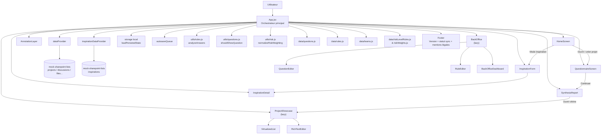

# Graphique Mermaid — architecture actuelle de la webapp

## Notes

- Le point d’entrée est `src/main.jsx` qui monte `App`.
- `App.jsx` pilote la navigation par écran (`home`, `questionnaire`, `synthesis`, `showcase`, `backoffice`) et les droits/états globaux.
- Les données métier proviennent des datasets locaux et des providers simulant SharePoint.
